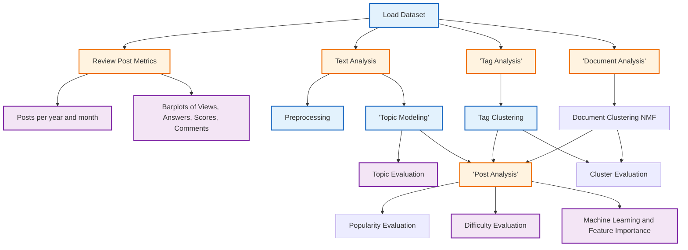

# Python Shiny APP for content analysis of Stack Exchange questions

This repository offers functionalities for text and tag analysis, along 
with options for evaluating topic popularity and difficulty. The application is
built using Python Shiny. The primary libraries are:
- shiny (front-end and server)
- scikit-learn (machine learning)
- tomotopy (topic modeling)
- nimfa (document clustering - Functionalities for Non-Negative Matrix Factorization NMF)
- nltk (text preprocessing)
- plotly/matplotlib/pyvis (data visualization)

## Overview

1. Load a dataset of questions using the APIs from https://data.stackexchange.com/.
2. Review post views, no answers and questions, and post dates
3. Conduct text preprocessing using post titles and body
4. Inspect frequent tags and words (title and body)
5. Run Topic Modeling (Titles + Body), Tag Clustering (Tags), Document Clustering (Titles + Body + Tags)
6. Evaluate Topic or Cluster popularity and difficulty
7. Multivariate analysis of post metrics based on text and tags using machine learning models

## Structure




## Screenshots
You can see some representative views of the current APP in screenshots/


```bash
pip install -r requirements.txt
```
